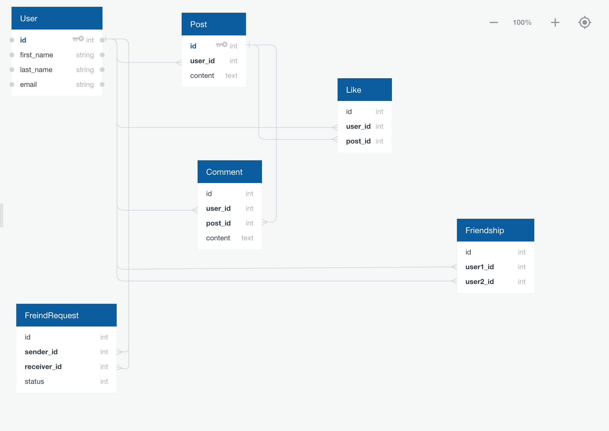

# FACELOOK (A Facebook Clone Project)
Facelook is a clone of some of the features of the Facebook app. Users can make friends, post contents and different posts can be liked and commented on by other users.
> https://www.facebook.com

## MODELS

The models in this application are;

- User: This is model for representing all signup users of the application

- Post: This is a content shared by a particular user

- Comment: This is similar to a post. It's a user's comment on a particular post

- Friendship: This is a model for representing a relationship between two Users

- FriendRequest: This represent an invite from a User (sender) to another User (receiver) in order to establish a friendship

- Like: Represent every like on a Post by different Users

## USE CASES

### User(while logged_in) (has_many :friends, class_name: "User" | has_many :posts | has_many :likes | has_many :comments)

- Can send a FriendRequest to another User

- Can be in a Friendship with another User that has accepted it FriendRequest.

- Can share a Post

- Can see Posts

- Can Comment on Posts

- Can Like a Post

### Post (belongs_to :user | has_many :likes | has_many :comments)

- Can be created by a User

- Can have several Comments

- Can have Several Likes

### Comment (belongs_to :post)

- Can be created by a User on a Post

### Like (belongs_to :post)

- Can be created by a User on a Post

